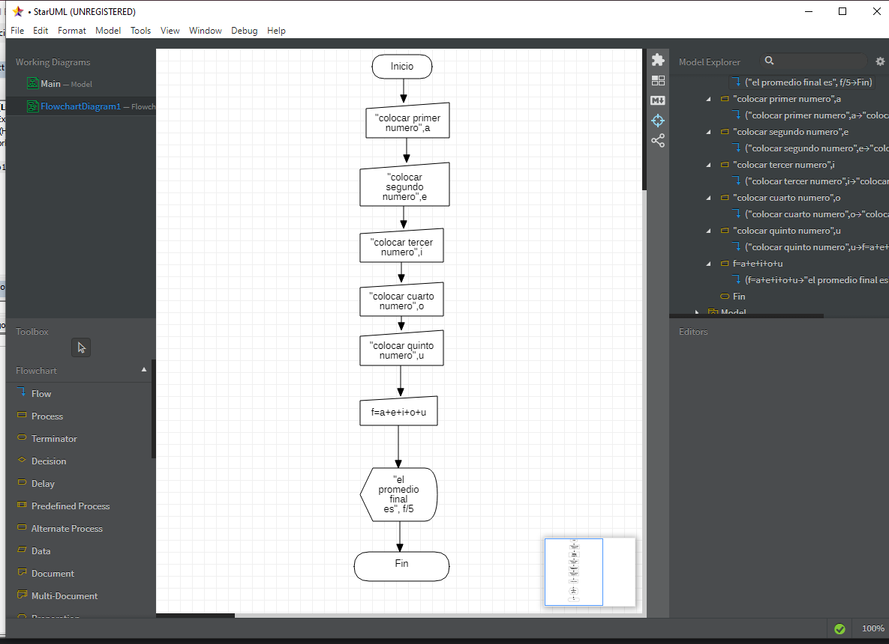

# **PROGRAMACION**


## **FECHA** <br>

### **septiembre 09 2021** <br>

en la clase se utilizaron los programas de excel visual basic 
y StarUML para seguir al fondo de la programacion cada vez mas 
esta vez se utilizo la combinacion de "MsgBox" y el "InputBox" 
recordamos que el comando "MsgBox" es para mostrar en execel lo 
que colocamos en visual basic y con el comando "InputBox" si 
queremos decirle o pedirle al usuario que digite informacion 
<br>

**EJEMPLO DE EXCEL VISAUL BASIC**
```
Sub ejemplo () 
    a = InputBox("digite primer numero")
    b = InputBox("digite segundo numero")
    c = a + b 
    MsgBox "la suma es " & c
End Sub
```
**EJERCICIO DE EXCEL VISUAL BASIC** 

```
Sub ejemplo ()
    a = InputBox("colocar primer numero")
    e = InputBox("colocar segundo numero")
    i = InputBox("colocar tercer numero")
    o = InputBox("colocar cuarto numero")
    u = InputBox("colocar quinto numero")
    f = Int(a) + Int(e) + Int(i) + Int(o) + Int(u)
    MsgBox "el promedio es "& f / 5
End Sub
```
**DIAGRAMA DE FLUJO DE STAR UML**


