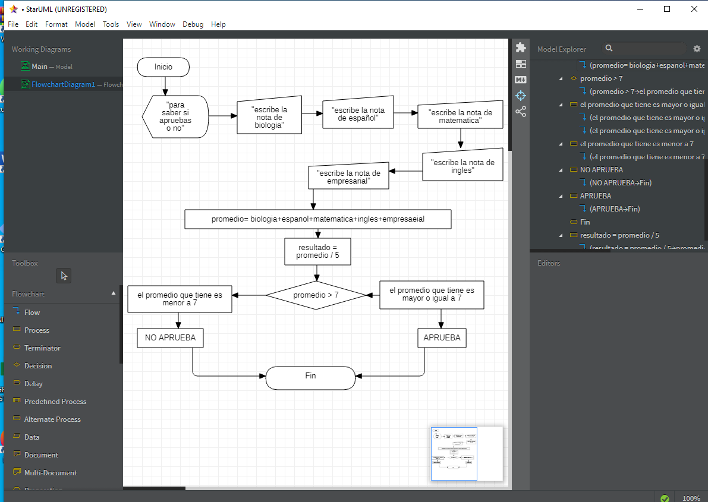

# **PROGRAMACION** 


## **FECHA** <br>

### **septiembre 13 2021** <br>

en esta clase aprendimos en visual basic a 
hacer que el programa tenga una serie de 
opciones para eso utilizamos en visual basic 
el codigo " Int(InputBox("texto")) "  <br>

### **EJEMPLO DE EXECL VISUAL BASIC** <br>
```
Sub ejemplo ()
    
    n = Int(InputBox("ingrese el primer 
    numero"))
    
    If (n > 10) Then
        MsgBox" n es mayor " & n & " o igual 
        que 10 "
    
    Else
        MsfBox" n es menor " & n & " que 
        10 "
    End If    
End Sub
```
### **EJERCICIO DE EXECEL VISUAL BASIC** <br>

```
Sub ejercicio()
  MsgBox " para saber si apruebas o no "
  biologia = Int(InputBox("escribe la nota de biologia"))
  español = Int(InputBox("escribe la nota de español"))
  matematica = Int(InputBox("escribe la nota de matematica"))
  ingles = Int(InputBox("escribe la nota de ingles"))
  empresarial = Int(InputBox("escribe la nota de empresarial"))
  sumatoria = biologia + español + matematica + ingles + empresarial
  resultado = sumatoria / 5
  MsgBox " el promedio que tines es " & resultado
  If (resultado > 7) Then
    MsgBox " el promedio que tiene " & n & " es mayor o igual a 7 "
    MsgBox " APRUEBA "
  
  Else
    MsgBox " el promedio que tiene " & n & " es menor a 7 "
    MsgBox " NO APRUEBA "
    
  End If
  
End Sub
```
### **DIAGRAMA DE FLUJO DE STAR UML** <br>




