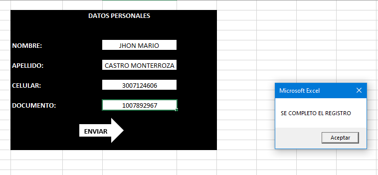

# **PROGRAMACION**


## **septiembre 20 2021** <br>
aprendimos a crear funciones con visual basic ejecutando " Function " tambien a hacer un registro en un cuadro y pasarlo a otra parte 
### **EXECEL VISUAL BASIC**
**EJEMPLO 1**
```
Sub ejercicio1()
    datos.Cells(3,1) = form.Cells(6,4)
    datos.Cells(3,2) = form.Cells(8,4)
    MsgBox "registro almacenado"
    form.Cells(6,4) = Empty
    form.Cells(8,4) = ""
End Sub
```
**EJEMPLO 2**
```
Function promediosena(a, b, c)
    promedio(a + b + c) / 3
    promediosena = promedio 
End Function
```
**EJERCICIO 1**
```
Sub PRIV()
    histo.Cells(2, 1) = arch.Cells(5, 5)
    histo.Cells(2, 2) = arch.Cells(7, 5)
    histo.Cells(2, 3) = arch.Cells(9, 5)
    histo.Cells(2, 4) = arch.Cells(11, 5)
    MsgBox "SE COMPLETO EL REGISTRO"
    arch.Cells(5, 5) = Empty
    arch.Cells(7, 5) = Empty
    arch.Cells(9, 5) = Empty
    arch.Cells(11, 5) = Empty
End Sub
```
**EJERCICIO 2**
```
Function misnotas(a, e, i, o, u)

    promedio = (a + e + i + o + u) / 5
    misnotas = promedio
    If (misnotas > 7) Then
        misnotas = " el promedio es mayor " & n & "o igual a 7 aprueba"
    Else
        misnotas = " el promedio es menor " & n & "a 7 no aprueba"
    End If
       
End Function
```
**FOTO DE EXECEL**

